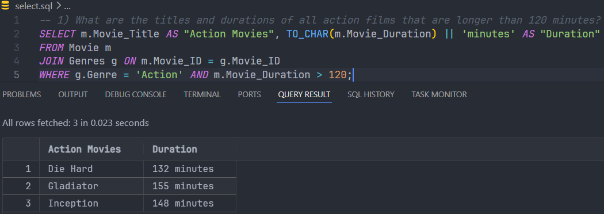
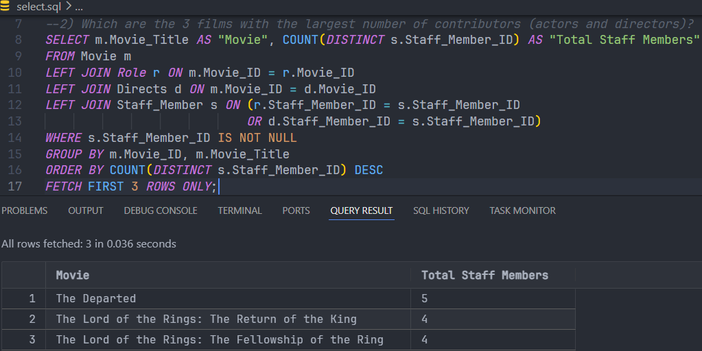
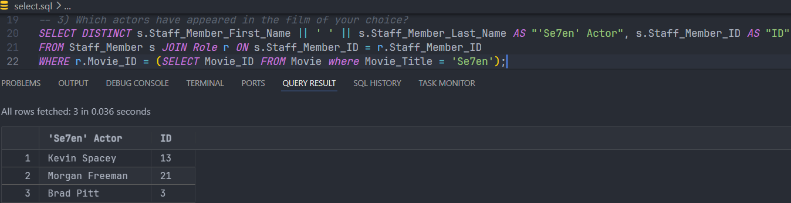
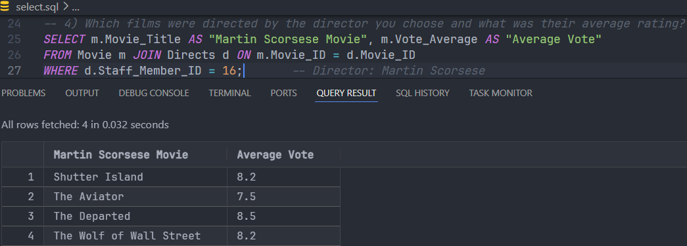
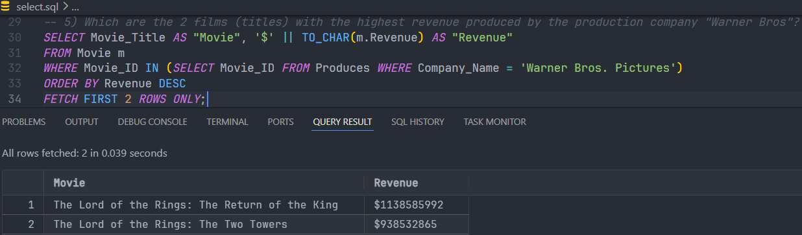
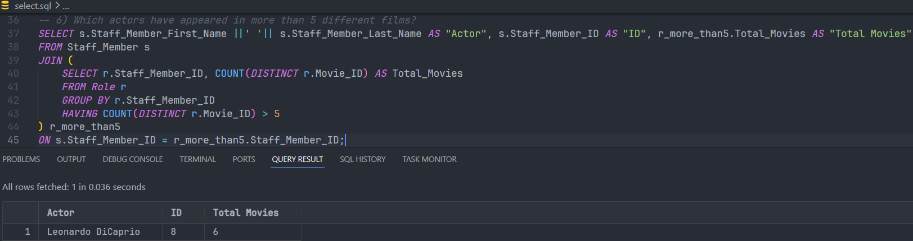
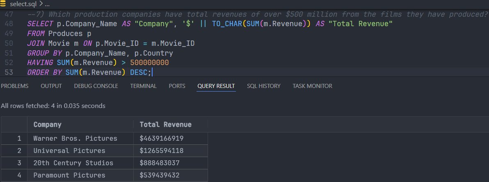
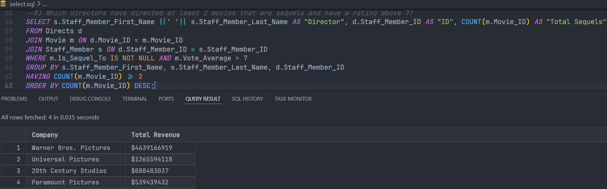
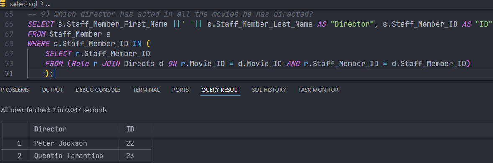

    <h1>
        Ενέργειες για την απεικόνιση διαγράμματος Ο-Σ σε σχεσιακό
    </h1>

---

    

---

Για το διάγραμμα Ο-Σ, έχει ληφθεί υπόψη ότι:
- Μία *ταινία* (**MOVIE**) πρέπει αυστηρά να έχει *παραχθεί* (**PRODUCES**) από μία *εταιρία* (**COMPANY**).
- Μία *ταινία* (**MOVIE**) μπορεί να έχει *παραχθεί* (**PRODUCES**) με περισσότερες από μία *εταιρίες*
  (**COMPANY**).
- Πολλά *μέλη του προσωπικού* (**STAFF_MEMBER**) μπορούν να έχουν *συγγράψει το σενάριο*
  (**WRITES_SCRIPT**) για την *ταινία* (**MOVIE**).
- Πολλά *μέλη του προσωπικού* (**STAFF_MEMBER**) μπορούν να έχουν *σκηνοθετήσει* (**DIRECTS**) την
  *ταινία* (**MOVIE**).
- Ο *ρόλος* (**ROLE**) δεν έχει μοναδικό γνώρισμα, γι’ αυτό είναι <u>weak entity</u> της *ταινίας* (**MOVIE**).
- Ο κάθε *ρόλος* (**ROLE**) είναι μοναδικός σε κάθε *ταινία* (**MOVIE**).
- Ο κάθε *ρόλος* (**ROLE**) μπορεί να *παίζεται* (**PLAYS**) μόνο από έναν *ηθοποιό* (**Staff_Member_ID**).

---

    

---

Επεξήγηση σχεσιακού μοντέλου:
- Το **Professional_Properties** είναι πλειότιμο γνώρισμα επειδή ένα *μέλος του προσωπικού*
  (**STAFF_MEMBER**) μπορεί να έχει πάνω από μία *επαγγελματική ιδιότητα*
  (**Professional_Properties**) και γι’ αυτό είναι νέος πίνακας.
- Το **Keywords** είναι πλειότιμο γνώρισμα επειδή μία *ταινία* (**MOVIE**) μπορεί να έχει πάνω από μία
  *λέξη-κλειδί* (**Keyword**) και γι’ αυτό είναι νέος πίνακας.
- Το **Genres** είναι πλειότιμο γνώρισμα επειδή μία *ταινία* (**MOVIE**) μπορεί να έχει πάνω από ένα *είδος*
  (**Genres**) και γι’ αυτό είναι νέος πίνακας.
- Επειδή η πληθικότητα της συσχέτισης **DIRECTS** είναι **M-N**, δημιουργούμε καινούριο πίνακα για
  αυτή τη συσχέτιση.
- Επειδή η πληθικότητα της συσχέτισης **WRITES_SCRIPT** είναι **M-N**, δημιουργούμε καινούριο
  πίνακα για αυτή τη συσχέτιση.
- Επειδή η πληθικότητα της συσχέτισης **PRODUCES** είναι **M-N**, δημιουργούμε καινούριο πίνακα για
  αυτή τη συσχέτιση.
- Η συσχέτιση **IS_SEQUEL_TO** είναι <u>foreign key</u> στην *ταινία* (**MOVIE**), αφού κάθε *ταινία* (**MOVIE**)
  μπορεί να είναι *sequel* μόνο σε μία άλλη *ταινία* (**MOVIE**).
- Επειδή η πληθικότητα της συσχέτισης **PLAYS** είναι **1-N**, έχουμε <u>foreign key</u> στην οντότητα *ρόλος*
  (**ROLE**) που δείχνει στο **Staff_Member_ID**.

---

> *Τα διαγράμματα δημιουργήθηκαν με [Visual Paradigm Online](https://online.visual-paradigm.com/).*

---

    <h1>
        Αποτελέσματα της εκτέλεσης των select ερωτημάτων
    </h1>

---

1) Ποιοι είναι οι τίτλοι και οι διάρκειες όλων των ταινιών δράσης που έχουν διάρκεια
   μεγαλύτερη από 120 λεπτά;

    

---

2) Ποιες είναι οι 3 ταινίες με τον μεγαλύτερο αριθμό συντελεστών (ηθοποιούς και
   σκηνοθέτες);

    

---

3) Ποιοι ηθοποιοί έχουν συμμετάσχει στην ταινία με τίτλο της επιλογής σας;

    

---

4) Ποιες ταινίες σκηνοθέτησε ο σκηνοθέτης που θα επιλέξετε και ποια ήταν η μέση
   βαθμολογία τους;

    

---

5) Ποιες είναι οι 2 ταινίες (τίτλοι) με τα περισσότερα έσοδα που έχει παράγει η εταιρεία
   παραγωγής "Warner Bros";

    

---

6) Ποιοι ηθοποιοί έχουν παίξει σε περισσότερες από 5 διαφορετικές ταινίες;

    

---

7) Ποιες εταιρείες παραγωγής έχουν συνολικά έσοδα άνω των 500 εκατομμυρίων δολαρίων
   από τις ταινίες που έχουν παράγει;

    

---

8) Ποιοι είναι οι σκηνοθέτες που έχουν σκηνοθετήσει τουλάχιστον 2 ταινίες που είναι sequels
   και έχουν βαθμολογία πάνω από 7;

    

---

9) Ποιος σκηνοθέτης έχει παίξει σε όλες τις ταινίες που έχει σκηνοθετήσει;

    

---

> *Όλα τα δεδομένα αντλήθηκαν από το [IMDb](https://www.imdb.com/).*